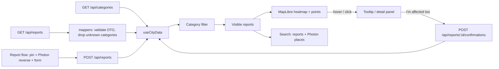

# System architecture

Status: proof of concept, 2026-10-03. The PostgreSQL/authentication foundation, the durable worker and the incident-response server slices with their staff screens are implemented; the resident map and form still use the mock report backend until their cutover.

The [voice and incident specification](../specs/001-voice-incident-response/spec.md) and [ElevenLabs technical plan](../specs/001-voice-incident-response/plan.md) define the remaining domain and data-flow changes. Independent search and decision-provider adapters are available. The official workspace, proposal approval and queued demo ticket execution are implemented; voice and provider workflow integration remain unfinished; institution ticket reads and updates are implemented.

## Direction

One Next.js application with feature modules on the server and browser. Frontend: Next.js (App Router, Turbopack, React Compiler), React 19, TypeScript (strict), Tailwind CSS v4 and Appica UI components. Package manager: npm; versions are pinned by `package-lock.json`. Appica components work in Server Components; move interactivity into small `"use client"` components.

```text
apps/
  frontend/                 # Next.js app (own package.json and lockfile)
    src/
      app/                  # Next.js routing, layout, providers, route handlers (mocks next to route.ts)
      api/<service>/        # one endpoint = one file; types.ts and mappers.ts per service
      features/<feature>/   # components/<component>/, hooks/, utils/ for that feature only
      shared/               # code used by several features: components/, theme/, styles/
      server/               # server-only auth, HTTP boundary, database/configuration
    db/migrations/          # numbered SQL migrations
    scripts/                # configuration checks, migrations and demo seeding
```

Each app in `apps/` is a standalone project with its own dependencies. The root `package.json` contains command shortcuts only; it is not a shared workspace. Create folders only together with code. Detailed frontend structure rules are in [apps/frontend/AGENTS.md](../apps/frontend/AGENTS.md). Features do not import other features' private files; logic (mappers, calculations) does not depend on React. Base components come from the `@appica/ui-react` package and are not copied into the repo. Do not build generic repositories, DI containers or internal libraries in advance.

## Libraries

| Library | Version | Role | Why |
| --- | --- | --- | --- |
| [Next.js](https://nextjs.org) | 16.3 | React framework: routing (App Router), server rendering, API route handlers, build (Turbopack). | Recommended way to build React apps; gives us mock `/api/categories` and `/api/reports` endpoints without a separate backend. |
| [React](https://react.dev) | 19.2 | UI library. The React Compiler memoises components automatically. | Required by Next.js and Appica UI. |
| [TypeScript](https://www.typescriptlang.org) | 5 | Static types (strict mode). | Catches contract errors between API, mappers and components early. |
| [Tailwind CSS](https://tailwindcss.com) | 4 | Utility-first CSS; configuration lives in CSS (`@theme`). | Required by Appica UI; our theme tokens map to Tailwind classes. |
| [Appica UI](https://appica.dev/ui) (`@appica/ui-react`) | 1.2 | 70+ accessible React components built on [Base UI](https://base-ui.com), styled with Tailwind tokens; includes `ThemeProvider`. | Ready-made components (Alert, Button, Dialog, …) so we do not hand-roll UI; one token set drives the neutral light and dark modes. |
| [MapLibre GL JS](https://maplibre.org) (`maplibre-gl`) | 6.11 | Open-source WebGL map renderer for vector tiles; native `heatmap` layer type. | Free, no API key, built-in GPU heatmap. Fork of Mapbox GL JS before its licence change. |
| [react-map-gl](https://visgl.github.io/react-map-gl/) (`react-map-gl/maplibre`) | 8.1 | React components for MapLibre: `<Map>`, `<Source>`, `<Layer>`. Maintained by vis.gl (the deck.gl team). | Declarative map layers in React instead of imperative MapLibre calls. |
| [OpenFreeMap](https://openfreemap.org) | service | Free hosted vector tiles and map styles (`positron` in light mode, `dark` in dark mode) built from [OpenStreetMap](https://www.openstreetmap.org) data. | No key, no registration, no request limits, commercial use allowed; attribution is shown automatically by MapLibre. |
| [Photon](https://photon.komoot.io) | service | Free geocoder over OpenStreetMap data: street and place search, and reverse geocoding for the report pin (`src/api/photon/`). | No key; CORS enabled; biased to Kraków. Public instance is fair-use only — self-host or swap for production. |
| [Geist](https://vercel.com/font) (`geist`, `next/font/local`) | 1.7.2 | Bundled sans and mono variable fonts served by the application. | Preserves Polish diacritics and removes the Google font download from development and builds. |
| [Appica Icons](https://appica.dev/ui/icons) (`@appica/icons-react`) | 1.1 | Icon set matching Appica UI. | One consistent stroke style for category, time, place and action icons. |
| [Zod](https://zod.dev) | 4 | Runtime schema validation. | Validates API responses at the boundary (`src/api/*/types.ts`), drops bad or uncategorised records instead of breaking the map, and validates new reports on both client and server. |
| `@types/geojson` | dev | TypeScript types for GeoJSON. | Types the feature collection passed to the heatmap source. |
| ESLint + `eslint-config-next` | 9 / 16.3 | Linting with Next.js and React rules. | Run with `npm run lint`. |
| PostgreSQL / `pg` | 17 / pinned in app lockfile | Durable identities, sessions, fictional institutions and login throttling. | One relational store with explicit SQL and transactions; later workflow tables use new migrations. |
| `tsx`, `@next/env`, Node crypto | pinned in app lockfile / Node runtime | Run TypeScript setup scripts, load host development settings and hash staff passwords. | Reuse the app's types/configuration; avoid a separate backend framework or authentication service. |
| Qdrant / `@qdrant/js-client-rest` | 1.19.1 / 1.19.0 | Derived dense/BM25 index and scoped provider operations in `server/search`. | One engine for keyword, semantic, hybrid and related retrieval; source/HTTP integration is pending. |
| `@huggingface/transformers` | 4.3.0 | Local CPU ONNX inference using pinned multilingual E5-small q8 weights. | Real Polish-capable embeddings without another cloud account or Python service; see [model and runtime limits](knowledge-base/qdrant-search.md). |

Swapping the map for Google Maps later means replacing only `features/city-map/components/city-map-canvas/city-map-canvas.tsx` with an implementation based on `@vis.gl/react-google-maps` and a deck.gl `HeatmapLayer` (see D013 in the [decision log](knowledge-base/decisions.md)).

## Data flow



Features in `apps/frontend/src/features/`:

- `city-map` — the map screen: data loading, map canvas, search, tooltip and report detail panel. Its view composes the other features through their top-level components.
- `category-filter` — the filter button and category checklist.
- `report-issue` — the report button, pin placement and report form.
- `incident-operations` — the official workspace at `/operations`: sign-in gate, review queue, incident and report-review panels, proposal approval, responsibility, verification and reopening. It reuses the city-map canvas (points, areas, muted private markers) and map settings, polls every three seconds while visible and keeps the last data with a stale notice when a refresh fails. Served from PostgreSQL behind an official session.
- `institution-inbox` — the institution screen at `/institution`: sign-in gate, the signed-in institution's tickets, the approved request, and the next allowed step (acknowledge, start work, resolve with a note, reject with a reason). Same polling and stale notice; an unsaved note survives refreshes and failed saves.

Shared building blocks (category label/tile/appearance, floating panel shell, accordion section, severity labels, time formatting) live in `src/shared/`. The map's mock backend still uses an **in-memory store**: submitted reports live until the app restarts. Its migration to persistent incidents changes the route contracts and `src/api/*` clients together, as defined by the feature plan.

Form state stays local. Search and filter parameters go into the URL when a view must be shareable. Add shared fetching and caching only when there is a real need. The theme belongs to the app shell; it does not change data or permissions.

The API layer maps external data to a small app model, validates the boundary and returns a clear result or error. Server modules validate writes, enforce permissions and hold secrets. The frontend is not a security boundary. The new authentication is not yet applied to the old public report fixtures; persistent report/incident work must use server sessions and migrate its callers as a complete slice.

Report/incident/service-ticket retrieval follows the [Qdrant search guide](knowledge-base/qdrant-search.md) (D029, D037, D050). `server/search` implements scoped provider operations with local dense inference and Qdrant BM25/RRF. It returns IDs/version metadata, never hydrated user results. PostgreSQL remains authoritative; source synchronization, current permission/version hydration, HTTP/MCP routes and app/worker integration are pending. The independent `compose.search.yaml` initializes the provider and model cache without switching existing application routes.

The [frontend–backend contract](api-contract.md) separates today's resident-report routes, the specified ElevenLabs voice-to-incident PoC, and later interfaces from the platform SPEC. The feature specification and plan govern the next implementation slice; public incident projections, private reports, official commands and institution tickets must not be collapsed into one record or route.

## Local backend foundation

Docker Compose runs one Next.js web/API process, one worker from the same codebase, and PostgreSQL on a persistent volume. A one-shot setup container waits for database health, applies SQL migrations and seeds fictional staff/institutions before the app and worker start. Root npm shortcuts validate required environment values; the production image checks the same runtime settings and requires an HTTPS application origin. Executable setup, restart and configuration instructions live in the [README](../README.md#running). The [Scaleway runtime](../deploy/README.md) adds Caddy HTTPS on one VM, revision-tagged images and backup-before-migration deployment commands. The Scaleway VM and runtime are provisioned; application rollout, public DNS/TLS and provider integration remain separate acceptance work, tracked in the [deployment record](../deploy/scaleway-release.md).

Authentication routes call `server/auth/`; password hashing is independent of Next.js and reused by the seed script. PostgreSQL holds identities, hashed session tokens and login throttling. Thin HTTP handlers own cookies, origin checks and common response envelopes. Permission guards read role and institution from the database. The new liveness/readiness endpoints distinguish a running process from usable database migrations. See the [implemented API contract](api-contract.md#backend-foundation-implemented) for exact shapes.

The [durable work module](../apps/frontend/src/server/jobs/README.md) implements the caller-transaction enqueue and typed triage/index/execute dispatch in workflow contract section 8. PostgreSQL stores work, leased attempts and a worker heartbeat. A session advisory lock limits the worker to one process; a per-source running constraint and fresh tokens protect claims and completion. Missing handlers park work without consuming attempts; transient handler failures get at most two retries. Delivery is at least once, so each domain handler owns business validation, version reconciliation and idempotent effects. Domain transactions can enqueue while the worker is unavailable, and provider calls stay outside source-write transactions. Report/incident schemas and handlers remain owned by their workflow slices.

Resident intake lives in `server/reports/`: pure draft rules (`draft-rules.ts`, `contracts.ts`) apart from data access (`drafts.ts`, `submission.ts`, `reports.ts`). Submission locks the draft row and commits the report, the draft's submitted state, an audit event (`server/audit/`) and pending triage/index work (`server/jobs`, owned by the search/worker workstream) in one transaction. `server/search-sources/` exposes the per-audience text the search index may hold. Route handlers build an `ActorContext` from the session and pass strict, schema-validated bodies; unknown properties are rejected. Incidents live in `server/incidents/`: the grouping policy (`triage-policy.ts`), location keys (`geo.ts`) and public wording (`public-templates.ts`) are pure; `triage.ts` re-reads candidates and commits a decision under a per-issue advisory lock; `public.ts` builds the allowlisted public projection and contribution membership; `responsibility.ts` reads configured demo rules and `observations.ts` is a labelled fixture feed. `server/actions/` holds proposals, official decisions and the trusted executor: a material incident change supersedes unexecuted proposals in the same transaction, approval queues one `execute` work item, and the executor claims the approval, calls the labelled demo connector (`server/institutions/demo-connector.ts`) outside any transaction and records exactly one ticket, a known failure or an unknown outcome. Official commands live in `server/incidents/official.ts`; `workspace.ts` projects the private queue. `server/institutions/tickets.ts` holds the institution-scoped ticket reads and the one-step progress update, which changes ticket, incident, public timeline, audit and index work in one transaction.

## Errors and states

Every data screen handles loading, result, empty and error with a possible next step. Forms keep entered data after an error. While saving, they block resubmission and confirm only after the response. Automatic retries of writes require idempotency on the API side.

## Growth after the hackathon

First: pagination and filtering at the data source, indexes for real queries and measuring slow operations. Move long tasks to a queue only when they block the response. Extract a service only when it needs independent deployment or scaling. Module boundaries make that change easier; extra infrastructure now would not speed up the demo.

## Verification

Follow the [policy in AGENTS.md](../AGENTS.md): no tests during the PoC phase; lint, type check, build and a manual review on phone and desktop, including the keyboard, in both themes.
