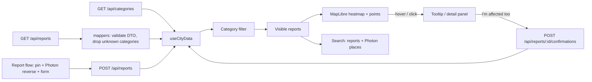

# System architecture

Status: proof of concept, 2026-10-03. The domain and the backend wait for the main product scenario.

The [voice and incident specification](../specs/001-voice-incident-response/spec.md) and [ElevenLabs technical plan](../specs/001-voice-incident-response/plan.md) define the next domain and data-flow changes. This architecture describes the implemented baseline; the specified voice, incidents, actors, persistence and approvals are not implemented yet.

## Direction

One frontend, modules by feature, and one backend only if the scenario really needs it. Frontend: Next.js (App Router, Turbopack, React Compiler), React 19, TypeScript (strict), Tailwind CSS v4 and Appica UI components. Package manager: npm; versions are pinned by `package-lock.json`. Appica components work in Server Components; move interactivity into small `"use client"` components.

```text
apps/
  frontend/                 # Next.js app (own package.json and lockfile)
    src/
      app/                  # Next.js routing, layout, providers, route handlers (mocks next to route.ts)
      api/<service>/        # one endpoint = one file; types.ts and mappers.ts per service
      features/<feature>/   # components/<component>/, hooks/, utils/ for that feature only
      shared/               # code used by several features: components/, theme/, styles/
  backend/                  # only if the scenario needs a server (does not exist yet)
```

Each app in `apps/` is a standalone project with its own dependencies; a shared workspace will be added once a second app needs to share code. Create folders only together with code. Detailed frontend structure rules are in [apps/frontend/AGENTS.md](../apps/frontend/AGENTS.md). Features do not import other features' private files; logic (mappers, calculations) does not depend on React. Base components come from the `@appica/ui-react` package and are not copied into the repo. Do not build generic repositories, DI containers or internal libraries in advance.

## Libraries

| Library | Version | Role | Why |
| --- | --- | --- | --- |
| [Next.js](https://nextjs.org) | 16.3 | React framework: routing (App Router), server rendering, API route handlers, build (Turbopack). | Recommended way to build React apps; gives us mock `/api/categories` and `/api/reports` endpoints without a separate backend. |
| [React](https://react.dev) | 19.2 | UI library. The React Compiler memoises components automatically. | Required by Next.js and Appica UI. |
| [TypeScript](https://www.typescriptlang.org) | 5 | Static types (strict mode). | Catches contract errors between API, mappers and components early. |
| [Tailwind CSS](https://tailwindcss.com) | 4 | Utility-first CSS; configuration lives in CSS (`@theme`). | Required by Appica UI; our theme tokens map to Tailwind classes. |
| [Appica UI](https://appica.dev/ui) (`@appica/ui-react`) | 1.2 | 70+ accessible React components built on [Base UI](https://base-ui.com), styled with Tailwind tokens; includes `ThemeProvider`. | Ready-made components (Alert, Button, Dialog, …) so we do not hand-roll UI; one token set drives both Civic and Signal. |
| [MapLibre GL JS](https://maplibre.org) (`maplibre-gl`) | 6.11 | Open-source WebGL map renderer for vector tiles; native `heatmap` layer type. | Free, no API key, built-in GPU heatmap. Fork of Mapbox GL JS before its licence change. |
| [react-map-gl](https://visgl.github.io/react-map-gl/) (`react-map-gl/maplibre`) | 8.1 | React components for MapLibre: `<Map>`, `<Source>`, `<Layer>`. Maintained by vis.gl (the deck.gl team). | Declarative map layers in React instead of imperative MapLibre calls. |
| [OpenFreeMap](https://openfreemap.org) | service | Free hosted vector tiles and map styles (`positron` in light mode, `dark` in dark mode) built from [OpenStreetMap](https://www.openstreetmap.org) data. | No key, no registration, no request limits, commercial use allowed; attribution is shown automatically by MapLibre. |
| [Photon](https://photon.komoot.io) | service | Free geocoder over OpenStreetMap data: street and place search, and reverse geocoding for the report pin (`src/api/photon/`). | No key; CORS enabled; biased to Kraków. Public instance is fair-use only — self-host or swap for production. |
| [Geist](https://vercel.com/font) (`next/font/google`) | — | Sans and mono typeface, self-hosted at build time by `next/font`. | Neutral, precise UI face with Polish diacritics; no runtime request to Google. |
| [Appica Icons](https://appica.dev/ui/icons) (`@appica/icons-react`) | 1.1 | Icon set matching Appica UI. | One consistent stroke style for category, time, place and action icons. |
| [Zod](https://zod.dev) | 4 | Runtime schema validation. | Validates API responses at the boundary (`src/api/*/types.ts`), drops bad or uncategorised records instead of breaking the map, and validates new reports on both client and server. |
| `@types/geojson` | dev | TypeScript types for GeoJSON. | Types the feature collection passed to the heatmap source. |
| ESLint + `eslint-config-next` | 9 / 16.3 | Linting with Next.js and React rules. | Run with `npm run lint`. |

Swapping the map for Google Maps later means replacing only `features/city-map/components/city-map-canvas/city-map-canvas.tsx` with an implementation based on `@vis.gl/react-google-maps` and a deck.gl `HeatmapLayer` (see D013 in the [decision log](knowledge-base/decisions.md)).

## Data flow



Features in `apps/frontend/src/features/`:

- `city-map` — the map screen: data loading, map canvas, search, tooltip and report detail panel. Its view composes the other features through their top-level components.
- `category-filter` — the filter button and category checklist.
- `report-issue` — the report button, pin placement and report form.

Shared building blocks (category label/tile/appearance, floating panel shell, severity labels) live in `src/shared/`. The mock backend is a set of Next route handlers with an **in-memory store**: submitted reports live until the dev server restarts. Replacing `src/app/api/*` with a real backend and keeping the `src/api/*` contracts is the intended path.

Form state stays local. Search and filter parameters go into the URL when a view must be shareable. Add shared fetching and caching only when there is a real need. The theme belongs to the app shell; it does not change data or permissions.

The API layer maps external data to a small app model, validates the boundary and returns a clear result or error. With server-side integration, the backend validates data again, enforces permissions and holds secrets. The frontend is not a security boundary. For the mock demo, replacing the mock route handlers in `src/app/api/` (and adjusting `src/api/` mappers) should be enough to connect the real API; do not build abstractions for providers that do not exist.

Planned ticket/incident retrieval for agents, MCP tools and shared user search follows the [Qdrant search decision and implementation guide](knowledge-base/qdrant-search.md) (D029). Read it before implementing those paths. This integration is not yet part of the data flow above; the authoritative ticket store remains undecided.

The [frontend–backend contract](api-contract.md) records the current resident API and the target interfaces for the complete incident-management SPEC. It distinguishes resident reports from deduplicated staff incidents and marks unimplemented routes explicitly.

## Errors and states

Every data screen handles loading, result, empty and error with a possible next step. Forms keep entered data after an error. While saving, they block resubmission and confirm only after the response. Automatic retries of writes require idempotency on the API side.

## Growth after the hackathon

First: pagination and filtering at the data source, indexes for real queries and measuring slow operations. Move long tasks to a queue only when they block the response. Extract a service only when it needs independent deployment or scaling. Module boundaries make that change easier; extra infrastructure now would not speed up the demo.

## Verification

Follow the [policy in AGENTS.md](../AGENTS.md): no tests during the PoC phase; lint, type check, build and a manual review on phone and desktop, including the keyboard, in both themes.
