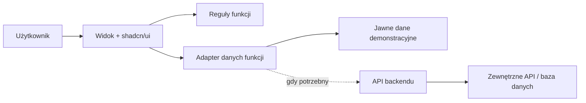

# Architektura systemu

Status: projekt startowy, 2026-10-03. Konkretna domena i backend czekają na pierwszy scenariusz produktu.

## Kierunek

Jeden frontend, moduły według funkcji i jeden backend, jeśli scenariusz rzeczywiście go wymaga. Proponowany frontend: React + TypeScript (strict), Vite i Tailwind CSS, komponenty shadcn/ui. Wersje i menedżer pakietów zostaną utrwalone w konfiguracji i lockfile podczas inicjalizacji aplikacji.

```text
src/
  app/                    # składanie ekranów, routing, dostawcy stanu
  features/<feature>/
    components/           # UI funkcji
    domain/               # czyste reguły, typy, ważne jednostki obok kodu
    api/                  # operacje danych i mapowanie odpowiedzi
  components/ui/          # komponenty shadcn/ui współdzielone przez motywy
  lib/                    # tylko faktycznie wspólne narzędzia
  styles/                 # wejście CSS importujące design-system/
```

To plan struktury: twórz katalogi dopiero wraz z kodem. Moduł udostępnia małe publiczne API; inne funkcje nie importują jego prywatnych plików. `domain` nie zależy od komponentów ani transportu. `components/ui` nie zna funkcji biznesowych. Nie buduj generycznego repozytorium, kontenera DI ani biblioteki wewnętrznej na zapas.

## Przepływ danych



Stan formularza pozostaje lokalny. Parametry wyszukiwania i filtrów trafiają do URL, jeśli trzeba udostępniać widok. Wspólne pobieranie i cache dodaj dopiero przy rzeczywistej potrzebie. Motyw należy do powłoki aplikacji; nie zmienia danych ani uprawnień.

Adapter mapuje dane zewnętrzne na mały typ domenowy, waliduje granicę i zwraca zrozumiały wynik albo błąd. Przy integracji serwerowej backend ponownie waliduje dane, egzekwuje uprawnienia i przechowuje sekrety. Frontend nie jest granicą bezpieczeństwa. Dla demonstracji z mockami wymiana adaptera powinna wystarczyć do podłączenia prawdziwego API; nie buduj abstrakcji dla nieistniejących dostawców.

## Błędy i stany

Każdy ekran danych uwzględnia: ładowanie, wynik, brak danych i błąd z możliwym następnym krokiem. Formularz zachowuje wprowadzone dane po błędzie. Podczas zapisu blokuje ponowne wysłanie i pokazuje potwierdzenie dopiero po odpowiedzi. Automatyczne ponowienie zapisów wymaga idempotencji po stronie API.

## Wzrost po hackathonie

Najpierw paginacja i filtrowanie przy źródle danych, indeksy dla realnych zapytań i pomiar wolnych operacji. Długie zadania przenoś do kolejki dopiero, gdy blokują odpowiedź. Wydzielaj usługę dopiero, gdy wymaga niezależnego wdrażania lub skalowania. Granice modułów ułatwią tę zmianę; dodatkowa infrastruktura teraz nie przyspieszy demonstracji.

## Weryfikacja

Stosuj [politykę z AGENTS.md](../AGENTS.md). Przykładowe kandydatury do jednostek po zdefiniowaniu domeny: dozwolone przejścia statusu, obliczanie priorytetu i walidacja danych wejściowych. Nie wdrażamy tych reguł bez wymagań. Wygląd obu motywów oceniaj ręcznie na telefonie i desktopie, również klawiaturą.
