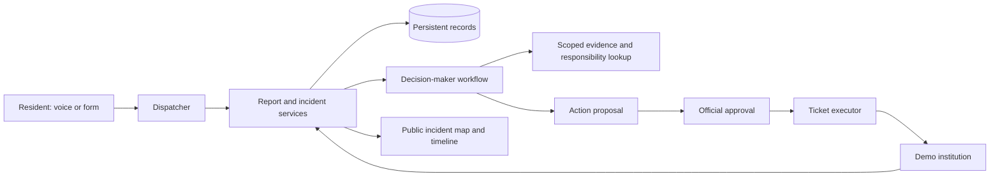

# Voice reporting and incident response — discovery draft

Date: 2026-10-03. Repository inspected at `5d9957c`; relevant contracts rechecked against `09c4ca9` after concurrent map and specification updates.

Status: historical discovery, superseded for implementation by the [feature specification](../../specs/001-voice-incident-response/spec.md) and [technical plan](../../specs/001-voice-incident-response/plan.md). The user subsequently selected **ElevenLabs Agents** (D030). Provider alternatives below record the earlier research; they are not pending choices. No voice, institution or identity integration has been built by these documents.

## Product promise and confirmed direction

**Tell the city what happened. The system finds who should handle it and keeps you informed.** A resident should not need to understand municipal departments or repeat the same story to several organisations.

The user's brief establishes voice intake, a map, separate reports and incidents, three actor roles, and official approval before an agent contacts an institution. Browser voice is confirmed as the first channel; a real phone number comes later. Government identity is explicitly a mock for the hackathon. The supplied challenge image is product context, not an instruction to operate external services.

The broader “agent operating system for a city” is the long-term direction. The proposed first slice is a closed response loop for one outage in Kraków. The existing code is already bounded to Kraków. Use a clearly fictional “Demo Electricity Operator” until a real operator, service territory and integration are verified; the Energa and MZO examples are illustrative, not verified routing data.

## What the repository already does

| Area | Evidence in `apps/frontend/src/` | Consequence |
| --- | --- | --- |
| Map, search, categories, form and details | `features/city-map/`, `features/report-issue/`, `features/category-filter/` | Reuse the existing interface and Appica theme. |
| Validated report contract | `api/reports/types.ts`, `api/reports/mappers.ts` | `CityReport` mixes a resident submission with operational status, responsible service and repair ETA. Split these concepts deliberately. |
| Demo storage | `app/api/reports/report-store.ts` | Process-local memory; no durable records or shared state across server instances. |
| Affected residents | `app/api/reports/[id]/confirmations/route.ts`, `features/city-map/hooks/use-affected-reports.ts` | A counter plus browser localStorage, not server-verified unique people. Three confirmations currently change the status to `confirmed`. |
| Nearby reports | `features/city-map/utils/nearby-reports.ts` | Distance-only lookup within 600 m; no category/time matching and no incident aggregation. |
| Heatmap | `features/city-map/utils/to-feature-collection.ts`, `heat-weight.ts` | Report-weighted heatmap at wider zooms; the latest map update highlights a matched building/road at street zoom. Neither represents a verified outage boundary or measured risk. |
| Data refresh | `features/city-map/hooks/use-city-data.ts` | Initial fetch, explicit retry and local mutations; no updates between resident and operator screens. |
| Location | `api/photon/` | Existing geocoding can support voice. A spoken address still needs disambiguation and resident confirmation. |

There is no incident entity, voice session, agent runtime, MCP server, institution registry, operator workspace, durable approval, server identity or external service connector in the inspected source. No tracked Spec Kit setup was found. The newer root `spec.md` is a broad product document, not generated Spec Kit artifacts. The current architecture remains documented in [architecture](../architecture.md).

## Relationship to the existing specification and parallel search decision

The newer [root specification](../../spec.md) describes a broader institutional platform: multi-tenancy, contractors, budgets, SLAs, onboarding and operations. Preserve that vision, but resolve these differences before generating the first implementation spec:

- It treats a ticket/incident report as one core record; this brief explicitly separates resident observations, operational incidents and institution work requests.
- It places the resident app outside its scope; this repository already contains that app, and browser voice is part of this requested end-to-end demo.
- Its production rollout and automated-testing proposals are future context. The current PoC rules remain in `AGENTS.md`; do not infer approval for Kubernetes, full SSO, finance workflows or automated tests.
- Named institutions, contact details, legal statements and SLA examples in that document are not verified integration contracts in this research.

The [Qdrant search guide](../knowledge-base/qdrant-search.md) (D029) records the user's selection of Qdrant for ticket/incident search, including uncategorized records. Preserve that choice when implementing retrieval; Qdrant is a derived search index, not the authoritative report/incident store. Use that guide for model and hosting settings. Candidate retrieval must not automatically merge incidents, and a search result may lack a category even though submitted map reports currently require one. Until the index is implemented, distinguish unavailable search from an empty result.

## Three implementation approaches

| Approach | Benefit | Cost / limitation |
| --- | --- | --- |
| **Recommended: conversational intake with a controlled workflow** | Natural follow-up questions; agents propose grouping and response; typed services enforce writes. Preserves the three roles in one application. | Requires explicit report, incident, action and ticket state. |
| Speech → text → ordinary agent → speech | Easier to inspect each step and reuse a text flow; useful fallback. | More turn coordination and potentially less fluid interruption handling. |
| Autonomous agents for every institution, each with its own service | A possible future federation between independently operated institutions. | Adds deployment, coordination, retry and authority problems before proving the resident journey. |

“Actor” initially means a role with a permitted tool set and scoped data. It does not require an actor framework, separate process, mailbox or independent LLM for each organisation. One backend and one database are sufficient for this proposed slice.

## The demonstration

1. A resident opens the existing map and starts a voice conversation: “There is no power on Jarzębinowa Street.”
2. The dispatcher asks for city/building, when the problem started, and whether it affects the apartment, building or street. It confirms the address and structured summary before submission.
3. The server saves a report and returns a real reference. The agent only then says it was recorded. A related open incident is shown if one exists.
4. Two further demo residents report the same outage. The triage workflow links the reports to one suspected incident. It preserves the separate observations.
5. The decision-maker retrieves a clearly labelled fixture representing a utility observation and proposes a ticket to the configured demo operator. The official sees the reports, observation time, matching rationale, destination and exact proposed action.
6. The official approves. The executor creates one service ticket. Repeating the click or retrying the request does not create another ticket.
7. The institution acknowledges the ticket, later marks work started, and finally reports resolution. Both screens display the resulting public incident timeline.

Include a short counterexample: an outage reported only inside one apartment. The agent records uncertainty and offers the appropriate review path; it does not announce a street-wide outage or declare the situation harmless. No existing report is not evidence that everything works. A missing telemetry reading is not zero consumption. A consumption drop can support a hypothesis but cannot establish its cause by itself.

For a private road or uncertain asset owner, the result is “responsibility needs review,” with the original report retained. The resident should not be sent back to guess another department.

## Domain vocabulary and boundaries

| Concept | Meaning and minimum information |
| --- | --- |
| Report | One submitted observation: ID, reference, category, description, observed/submitted times, confirmed location, channel, resident/session reference, scope (`unit`, `building`, `street`, `unknown`) and optional incident link. |
| Incident | One operational case: ID, category, location/area, linked reports, assessment, response status, proposed/assigned institution and public summary. |
| Evidence | A report, resident corroboration, operator observation or human assessment with source, observation time, retrieval time and `demo`/`live` provenance. |
| Institution | A configured organisation with service categories, territory/assets, permissions and capabilities. |
| Action proposal | A versioned intended operation: incident, destination, payload, supporting evidence, rationale and approval state. |
| Service ticket | A request acknowledged by an institution, with a local/external reference and its own execution status. |
| Audit entry | Who or which actor did what, when, to which record, with the result and correlation ID. |

A report can be awaiting triage, linked, or retained for private-property/out-of-scope review. In the PoC it links to at most one active incident. Preserve report IDs when correcting links; reassign with a recorded reason rather than deleting observations.

Separate incident assessment (`suspected`, `corroborated`, `verified`, `disputed`) from response progress (`new`, `triaged`, `assigned`, `in_progress`, `resolved`, `closed`). Multiple resident reports can corroborate a problem; verification needs recorded evidence or an authorised human assessment. An institution accepting a ticket does not mean a repair has started. A human can reopen a case with a reason.

Grouping should first narrow candidates by category, time, confirmed location and known asset/service territory. An LLM can compare descriptions and explain a suggestion. Proximity alone must not merge a blocked drain with an electricity outage. Ambiguous matches stay in the review queue. Distance and time thresholds belong in the later specification, calibrated to the chosen fixture; they are not universal city rules.

The public map should show incidents, their assessment and counts of supporting observations. Detailed reports remain available to authorised operators. Label the heatmap “reported impact”; it is neither a confidence score nor an inferred physical outage footprint. Move the existing “I'm affected too” action to incidents, deduplicate against the reporting identity/session on the server, and describe demo identities as simulated. Do not claim existing seed counters represent distinct verified residents.

## Roles, responsibilities and tools

The dispatcher owns conversation and report submission. The decision-maker owns triage and action proposals. The official owns approval. The institution role owns its ticket handling and scoped observations.

An institution's **responsibility** describes which issues and places it should handle; **permissions** describe which records it may read/write; **capabilities** describe operations available through tools. These are separate. A sanitation organisation does not automatically have sewer telemetry access. Calling this a “sandbox” is useful conceptually, but isolation must be enforced by server checks.

The following is a proposed application tool catalogue, not a list of existing third-party MCP services. Implement the underlying domain operations once, then expose the required subset through function calling or MCP.

| Tool | Inputs → output | Caller / boundary |
| --- | --- | --- |
| `resolve_location` | Address, city, optional pin → candidates, coordinates and ambiguity | Dispatcher; lookup only. Resident confirms the chosen location. |
| `find_incidents` | Location, category, observation time → permitted incident summaries | Dispatcher and decision-maker; public or operator projection according to role. |
| `submit_report` | Confirmed structured report, submission key → report reference and triage state | Dispatcher; validated write for the current resident/session only. |
| `get_incident_context` | Incident ID → reports, evidence, current state and version | Decision-maker; scoped access. |
| `triage_report` | Report ID, candidate incident or proposed new case, rationale → linked/new/review-needed | Decision-maker; server checks matching rules and writes atomically. |
| `resolve_responsibility` | Category, location, optional asset → candidates with source and reason, or unknown | Decision-maker; configured registry, never a guessed company name. |
| `get_service_observations` | Institution, area/asset, time range → authorised observations with provenance | Decision-maker/institution only when their permissions allow it. Demo fixture first. |
| `propose_action` | Incident version, permitted action, institution, evidence references → pending proposal | Decision-maker; cannot approve or execute its proposal. |
| `create_service_ticket` | Approved proposal ID → durable ticket reference and result | Trusted executor only; validates approval, scope, version and idempotency. |
| `get_service_ticket` | Ticket ID → delivery/acknowledgement/work status | Scoped decision-maker or assigned institution. |
| `update_service_ticket` | Ticket ID, allowed transition, update → recorded state and public-safe event | Assigned institution; cannot mutate another institution's tickets. |

Human actions such as approving/rejecting a proposal, correcting a report link and reopening an incident should be authenticated application commands, not tools available to a resident voice agent. An institution capability should be `create_service_ticket` or `request_cleanup`, not `clean_street`: software requests work and records outcomes; it does not itself perform physical maintenance.

Every write validates its input and authenticated scope server-side. Identity and institution permissions come from the session, not model-generated fields. Approval binds to a specific proposal version and payload; changed destinations or actions require new approval. Use a stable idempotency key for submissions and ticket execution, plus a transaction/version check for concurrent triage. Unknown execution outcomes must be reconciled by key/reference before retrying.

Start with one MCP server only if the chosen voice/agent integration benefits from it. Give roles narrow tool lists, while enforcing the same restrictions inside handlers. MCP discovery and approval UI do not replace application authorisation. The [official MCP TypeScript SDK documentation](https://github.com/modelcontextprotocol/typescript-sdk/blob/main/docs/serving/authorization.md) describes server token verification and per-operation scopes.

## Historical technology comparison

| Need | Proposed choice | What remains to verify |
| --- | --- | --- |
| Browser conversation | GPT-Live over WebRTC — considered, not selected | Account access, Polish address recognition, interruptions, backend tool completion and session cost. This earlier recommendation was superseded by D030. |
| Selected voice platform (D030) | **ElevenLabs Agents + `@elevenlabs/react`** | Same voice scenarios and account limits; use Appica for controls, retaining the provider SDK underneath. |
| Historical OpenAI alternative | Realtime API with function tools or remote MCP — not selected | Considered during discovery; D030 selects ElevenLabs. |
| Related-record retrieval | Qdrant, as selected in D029 | Integration, Polish retrieval quality, scoped access and index freshness; keep source records in the primary database. |
| Reasoning | One backend LLM with structured outputs and a bounded tool workflow | Model quality on the actual triage cases. Use ordinary TypeScript for permission checks and state transitions. |
| Map and geocoding | Existing MapLibre/OpenFreeMap and Photon adapters | Voice address confirmation and service failure fallback. No map replacement needed. |
| Storage | One PostgreSQL database for the shared demo | Existing team hosting/access. SQLite is an alternative only for a deliberately single-server demo with durable disk. |
| Updates | Short polling of incidents and tickets initially | Refresh interval and measured delay between resident and operator screens; add SSE only if needed. |
| Institution integration | Typed in-app demo connector and institution screen | Fixtures, supported transitions and failure simulation; no real utility access assumed. |
| Government identity | Clearly labelled mObywatel/login.gov.pl demo identity | No real government authentication. Keep browsing and intake possible without the optional mock login. |
| Observability | Persisted action/evidence audit; voice session and request correlation IDs | Redaction and retention configuration. A separate tracing product is optional. |

[OpenAI's current voice guidance](https://developers.openai.com/api/docs/guides/audio) recommends GPT-Live for a new conversational app. [GPT-Live](https://developers.openai.com/api/docs/guides/live) separates speech interaction from backend task execution. Its [WebRTC guide](https://developers.openai.com/api/docs/guides/voice-webrtc?api=live) requires a trusted server holding the API key and a browser on HTTPS or localhost. The guide's Node example requires 22.6+, above this repository's declared minimum of 20.9; check runtime requirements when selecting the SDK. [Realtime tool support](https://developers.openai.com/api/docs/guides/realtime-mcp) offers both application-executed functions and remote MCP calls.

ElevenLabs provides a [React SDK](https://elevenlabs.io/docs/eleven-agents/libraries/react), [MCP connections with tool-level approval controls](https://elevenlabs.io/docs/eleven-agents/customization/tools/mcp), and [Twilio phone integration](https://elevenlabs.io/docs/eleven-agents/phone-numbers/twilio-integration/native-integration). The documented phone path supports inbound calls through provisioned Twilio numbers; verified caller IDs alone are outbound-only. Phone provisioning and actual availability would need checking later. No price or Polish voice-quality advantage has been established in this research.

[Official login.gov.pl guidance](https://www.gov.pl/web/login/jak-korzystac) distinguishes access to public services and identity methods, including the mObywatel flow. In this PoC, use a demo session with invented data and an explicit simulated-identity label; do not collect real identity documents or credentials.

For the selected ElevenLabs integration, validate the following utterances: ambiguous Jarzębinowa address, corrected building number, interruption, apartment-only outage, repeated submission, tool timeout and recovery. Record task completion, address correctness and perceived delay. This is a manual evaluation, not a new automated test suite. Use one provider for the first implementation.

## Proposed application shape

Keep Next route handlers as HTTP boundaries and reuse `src/api/` clients. Add a server-only feature-organised area for reports, incidents, institutions and actions; keep domain functions independent of React and provider SDKs. The voice adapter and a thin MCP adapter call those services. Add UI features for voice reporting, the operator queue and the institution inbox. This is a proposed extension to the existing architecture, not an implemented folder layout.

Use the current `/api/reports` flow as the migration starting point. Introduce explicit incident contracts and move operational status, responsibility and ETA onto incidents/tickets. Update the map, search, detail panel, confirmations and category counts together; do not silently rename `CityReport` while retaining the old semantics. Existing fixtures are demonstration observations, not historical incidents to infer with AI.

Server restart must preserve reports, approvals and tickets. Keep processing bounded and record a pending/failed triage state so an operator can retry it. If the selected voice provider needs a persistent control connection, use a runtime that supports it; a short-lived request handler is not a background worker. Add a durable queue only if the first implementation actually needs work to outlive requests.

## First delivery sequence and review criteria

| Slice | Deliverable | Manual acceptance |
| --- | --- | --- |
| 1. Domain and persistence | Reports, incidents, fixture institutions, evidence and timeline | Three related reports become one case; a nearby different-category report stays separate; refresh/restart retains data. |
| 2. Human response loop | Operator queue, proposal approval and demo institution ticket | Approval creates exactly one ticket; rejection creates none; another institution cannot update it. |
| 3. Browser voice | One provider, clarification, address/summary confirmation, existing form fallback | A resident completes the same reporting journey by voice; a failed save never produces a success announcement. |
| 4. Agent-assisted triage | Candidate matching, evidence lookup, routing and explained proposal | The proposal cites stored evidence; unknown jurisdiction/ambiguous matching goes to review. |
| 5. Public feedback and rehearsal | Incident map, cross-screen refresh, demo login and failure paths | The resident sees acknowledgement, work progress and resolution without personal report details leaking. |

An ElevenLabs configuration check can happen before slice 1; production voice integration follows a functioning report service. Stop adding features when the full loop works. Defer outbound calls, real phone intake, X ingestion, civic-budget voting, 3D city simulation, general-purpose RAG beyond the selected Qdrant retrieval scope, multi-city support and production identity/utility integrations.

Geoportal/MSIP remains a possible asset-context source, as described in the [geospatial note](../knowledge-base/geospatial-data.md). A parcel map alone is not a validated maintenance-responsibility registry. No Geoportal endpoint, real utility telemetry feed or private-road ownership integration was exercised in this research.

Review failures explicitly: microphone denied, ambiguous location, disconnection before/after submission, provider timeout, duplicate requests, concurrent grouping, stale approval, unknown institution, rejected ticket and lost observation feed. Preserve a report and offer a next step. Public responses omit resident identity, apartment details and raw transcripts. Proposed demo retention: do not retain raw audio in the application; store only the necessary structured report and restricted diagnostic data. Provider-side retention needs a separate configuration check.

For reported immediate danger, the demo should clearly direct the resident to emergency services and preserve the escalation flag; it must not claim that creating an ordinary city ticket dispatches emergency responders. This is a product boundary, not an emergency triage capability.

Follow the existing PoC verification policy: no automated tests unless requested; lint, type check, build, and manual mobile/desktop, keyboard and failure-state review. Proposed measurable demo outcomes are one report per submission key, one ticket per approved action, correct separation of unrelated reports, and a visible completed response loop. Measure voice/refresh latency before setting numerical targets.

## Handoff to GitHub Spec Kit

The referenced project is [GitHub Spec Kit](https://github.com/github/spec-kit). Use one feature for this complete response loop, delivered through the slices above. Keep this discovery document as supporting research; it must not silently become an approved specification.

The [official workflow reference](https://github.github.io/spec-kit/reference/agentic-sdd.html) separates principles, requirements, clarification, technical planning, tasks and implementation. Invocation varies by agent; current Codex skills use names such as `$speckit-specify`. Confirm the installed version before running it.

| Stage | Input from this repository/discovery |
| --- | --- |
| Constitution | Existing `AGENTS.md`: small PoC, feature boundaries, Appica, English, no tests unless requested, honest demo labels, branch/PR rules. Do not adopt generic TDD defaults. |
| Specify | Resident/official/institution stories, report vs incident definitions, approval boundary, demo journey and acceptance outcomes. |
| Clarify | Chosen scenario and provider, available hosting/accounts, grouping policy, public visibility and exactly which state transitions are automatic. |
| Plan | Selected voice transport, persistent store, server/domain boundaries, contracts, migration and failure handling. |
| Tasks / analyze | Dependency-ordered slices; verify each requirement has an implementation and manual verification step. |
| Implement / converge | Build and review one working slice at a time, preserving repository rules. |

Seed for the future feature specification:

> A resident can report a city service disruption through a browser voice conversation or form without choosing a department. The system clarifies and confirms the location and scope, records the report once, and links related reports to a separately tracked incident. An authorised official reviews evidence and approves or rejects a proposed institution ticket. Only an approved action can create that ticket. A demo institution records acknowledgement, work progress and resolution, and residents can follow a public incident timeline. Ambiguous responsibility remains in a review queue. Government identity, utility observations and institution integration are clearly labelled simulations.

Subsequent resolution: browser-first ElevenLabs is confirmed. The feature specification now defines the demo and behavior defaults; its plan records persistence and refresh defaults. Provider setup and deployment ownership remain implementation inputs. Use those documents rather than this historical draft for new tasks.

## Research verification

Read the knowledge base, architecture, recent Git history, report routes/store/contracts, data hook, confirmation flow, geocoding adapters, nearby matching and heatmap mapping. Checked the cited official provider and Spec Kit documentation on 2026-10-03. No API credentials, voice calls, telemetry, government login, phone provisioning or deployment were exercised.

Application dependencies are absent in this checkout, so lint, type check, build and browser review were not run for this documentation-only change. Documentation links and diff formatting are checked separately. This research establishes the source-code baseline, not a runtime health claim.
